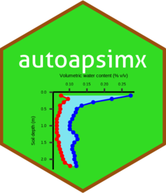
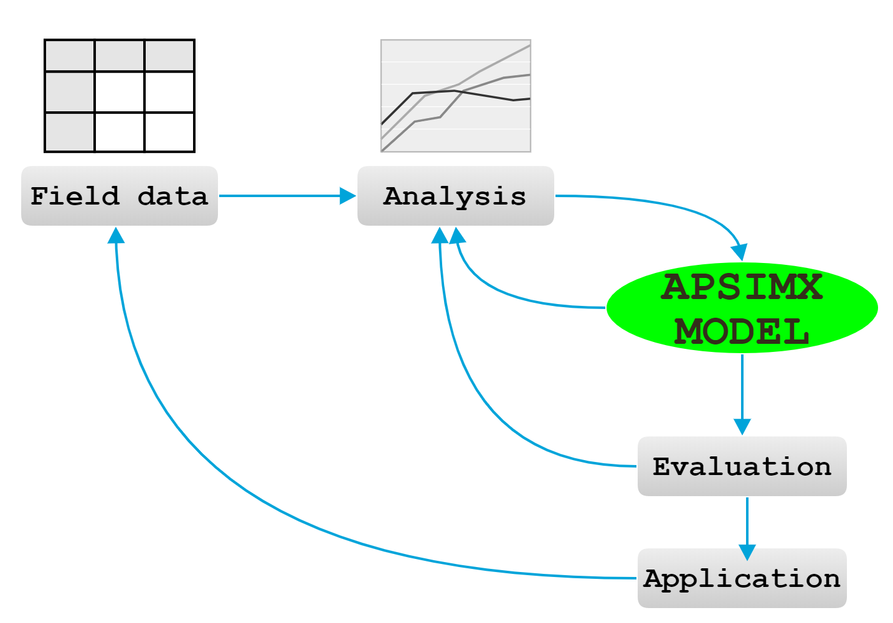

# autoapsimx

<!-- badges: start -->
[](https://www.tidyverse.org/lifecycle/#experimental)
<!-- badges: end -->

<a href='https://frank0434.github.io/autoapsimx'></a>

Automating the Pipeline of the ApsimX Model Development 




## Installation

You can install the develop version of autoapsimx from [Github](https://github.com/frank0434/autoapsimx) with:

``` r
remotes::install_github("frank0434/autoapsimx")
```

## Example

This is a basic example which shows you how to solve a common problem:

``` r
library(autoapsimx)
```

